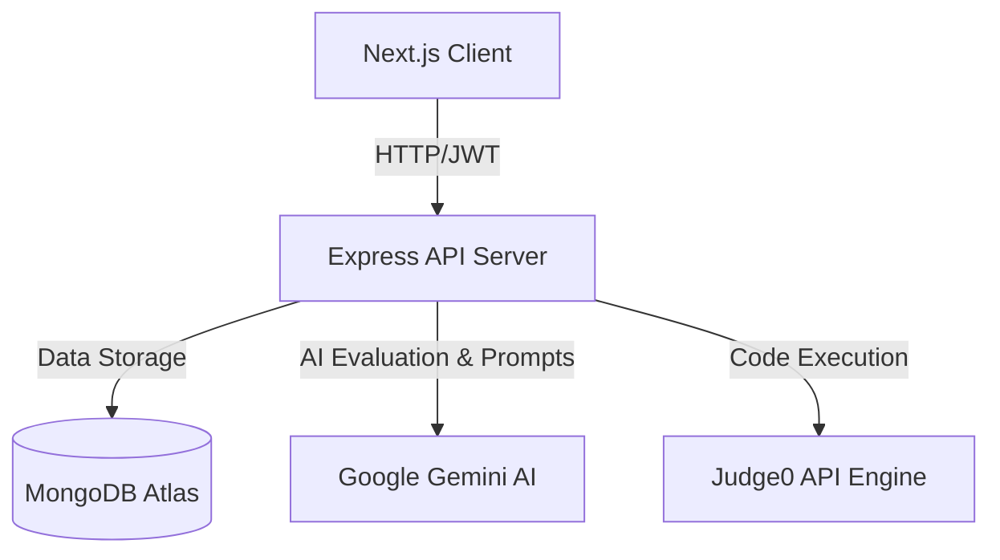

# 🚀 PrepForge: AI-Powered Technical Interview Prep

[](https://nextjs.org/)
[](https://tailwindcss.com/)
[](https://nodejs.org/)
[](https://www.mongodb.com/)
[](https://deepmind.google/technologies/gemini/)
[](https://judge0.com/)

**PrepForge** is a state-of-the-art technical interview preparation platform designed to bridge the gap between learning and landing your dream job. It combines a rigorous problem-solving environment, real-time code compilation, and cutting-edge AI assistance for resume parsing and mock interviews.

---

## 🌟 Key Features

### 📊 Intelligent Candidate Dashboard
*   **Progress Tracking & Streaks:** Maintain motivation with current streak tracking, high-score points, and solving accuracy rates.
*   **Topic Analysis:** Interactive visual analytics mapping your strongest and weakest categories via tag aggregation.
*   **Smart AI Recommendations:** Dynamically suggests your next problem based on past execution history and performance gaps.

### 💻 Advanced Problem Workspace
*   **Multi-Language Compiler:** Write and execute code in **JavaScript**, **Python**, or **C++** using the **Judge0 API**.
*   **Monaco Editor Integration:** Enjoy a VS Code-like coding experience equipped with syntax highlighting, auto-completion, and custom themes.
*   **Personal Notes Workspace:** Keep private notes, time/space complexity analysis, and algorithms directly linked to each challenge.

### 🎙️ AI Mock Interview Simulator
*   **Real-time AI Critique:** Engage in text/voice-based mock interviews and receive score cards detailing your strong points and improvement areas.
*   **Professional Timer:** Simulate real-time interview pressure with configurable timers.
*   **Live Hints & STAR Guidelines:** Get context-specific guidance based on the **STAR** method (Situation, Task, Action, Result) if you get stuck.

### 📄 AI Resume Analyzer
*   **ATS Optimization Score:** Instantly check your resume score against common automated applicant tracking systems.
*   **Skill Gap Finder:** Automatically scan resumes to identify missing technical keywords or domain knowledge for targeted roles.
*   **Tailored Career Paths:** Get recommendations customized for Frontend, Backend, Machine Learning, and Data Analyst roles.

---

## 🛠️ Architecture & Tech Stack



### Frontend
*   **Framework:** Next.js (App Router)
*   **Styling:** Tailwind CSS & Framer Motion (for elegant transitions)
*   **State Management:** Zustand
*   **Icons:** Lucide React

### Backend
*   **Runtime:** Node.js (Express.js)
*   **Database:** MongoDB Atlas with Mongoose ORM
*   **Authentication:** JSON Web Tokens (JWT) & bcrypt hashing
*   **AI Integration:** `@google/generative-ai`

---

## 🚀 Getting Started

### Prerequisites
Make sure you have the following installed:
*   [Node.js](https://nodejs.org/) (v18.0.0 or higher)
*   [MongoDB](https://www.mongodb.com/try/download/community) (Local instance or MongoDB Atlas Connection String)

### Installation

1.  **Clone the repository:**
    ```bash
    git clone https://github.com/mrityunjay5004/SkillForge.git
    cd SkillForge
    ```

2.  **Install dependencies (Root, Frontend, & Server):**
    ```bash
    # Install root dependencies
    npm install

    # Install Frontend dependencies
    cd frontend && npm install

    # Install Backend/Server dependencies
    cd ../server && npm install
    ```

3.  **Configure Environment Variables:**

    Create a `.env` file in the `/server` directory:
    ```env
    PORT=5000
    MONGO_URI=your_mongodb_connection_string
    JWT_SECRET=your_jwt_signing_key_here
    GEMINI_API_KEY=your_google_gemini_api_key
    JUDGE0_API_KEY=your_rapidapi_judge0_key_here
    ```

    Create a `.env.local` file in the `/frontend` directory:
    ```env
    NEXT_PUBLIC_API_URL=http://localhost:5000/api
    ```

4.  **Run Development Servers:**

    From the root project folder, you can boot up both servers simultaneously:
    ```bash
    npm run dev
    ```
    *   **Frontend:** `http://localhost:3000`
    *   **Backend:** `http://localhost:5000`

---

## ☁️ Deployment

### Frontend (Vercel)
1.  Import your GitHub repository into Vercel.
2.  Configure environment variables:
    *   `NEXT_PUBLIC_API_URL`: Your hosted backend URL (e.g., `https://prepforge-api.onrender.com/api`).
3.  Deploy! Vercel will automatically detect Next.js and handle building.

### Backend (Render)
1.  Create a new **Web Service** on Render and connect your GitHub repo.
2.  Specify settings:
    *   **Root Directory:** `server`
    *   **Build Command:** `npm install`
    *   **Start Command:** `node server.js`
3.  Add all variables from your server `.env` file to Render's Environment section.

---

## 🤝 Contributing

Contributions are welcome! Please follow these steps:
1.  Fork the Project.
2.  Create your Feature Branch (`git checkout -b feature/AmazingFeature`).
3.  Commit your Changes (`git commit -m 'Add some AmazingFeature'`).
4.  Push to the Branch (`git push origin feature/AmazingFeature`).
5.  Open a Pull Request.

---

## 📄 License

Distributed under the MIT License. See `LICENSE` for more information.
